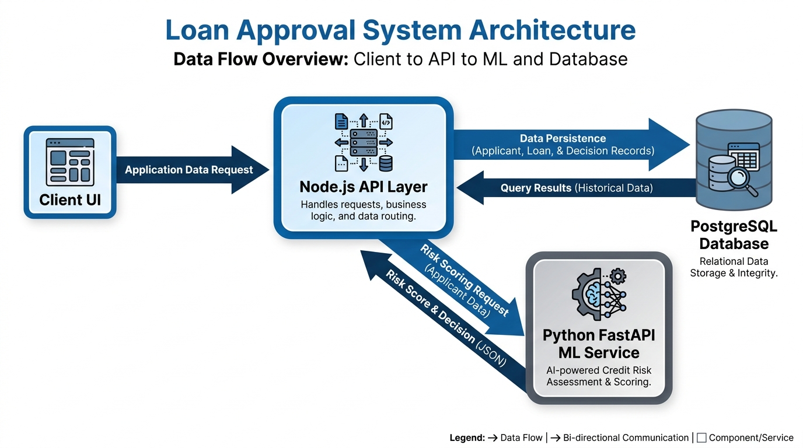

# Architecture Overview

## Diagram

- Open image: [architecture-diagram.png](architecture-diagram.png)



## Goal

Build an end-to-end loan approval prediction system with three main layers:

- A Node.js API layer for user requests, security, persistence, and orchestration.
- A Python FastAPI service for machine learning inference.
- PostgreSQL for transactional and historical data storage.

This split keeps product logic, machine learning logic, and data storage separated while still allowing them to work together through HTTP calls.

## System Context

The system receives loan application data from a client interface. The Node.js backend validates the request, stores the submission in PostgreSQL, and forwards the features to the Python ML service. The Python service loads the trained model, preprocesses the input, runs inference, and returns the prediction score and decision. Node.js persists the result and returns a response to the client.

## High-Level Flow

1. User submits an application from the UI.
2. Node.js validates authentication, request shape, and business rules.
3. Node.js stores the application request in PostgreSQL.
4. Node.js sends the approved feature payload to the Python FastAPI service.
5. Python preprocesses the payload and runs the model.
6. Python returns prediction output and supporting metadata.
7. Node.js stores the prediction result in PostgreSQL.
8. Node.js responds to the client with the result and next steps.

## Component Responsibilities

### Node.js API Layer

- Receives client requests.
- Handles authentication and authorization.
- Validates request payloads.
- Stores applications and prediction history.
- Calls the Python ML service.
- Exposes endpoints for application submission, prediction history, and health checks.

### Python ML Service

- Loads trained model artifacts.
- Applies preprocessing to incoming features.
- Produces loan approval predictions.
- Returns structured prediction results.
- Can be extended later for retraining or model versioning.

### PostgreSQL

- Stores loan applications.
- Stores model prediction results.
- Stores audit and traceability data.
- Supports reporting and future analytics.

## Repository Layout

```text
AI- Loan Approval Prediction/
├─ server/
│  ├─ controllers/
│  ├─ middleware/
│  ├─ models/
│  ├─ routes/
│  ├─ services/
│  ├─ utils/
│  ├─ config/
│  ├─ tests/
│  ├─ .env.example
│  ├─ package.json
│  └─ README.md
├─ ml-service/
│  ├─ app/
│  │  ├─ api/
│  │  ├─ core/
│  │  ├─ schemas/
│  │  ├─ services/
│  │  └─ models/
│  ├─ data/
│  ├─ notebooks/
│  ├─ artifacts/
│  ├─ scripts/
│  ├─ tests/
│  ├─ main.py
│  ├─ requirements.txt
│  └─ README.md
├─ docs/
│  ├─ architecture.md
│  └─ design.md
```

## Communication Pattern

The services communicate synchronously over HTTP for prediction requests. Node.js acts as the API gateway and system of record, while Python is a specialized scoring service. This keeps the ML code isolated and easier to iterate on without touching the main application layer.

## Non-Functional Goals

- Keep prediction latency low enough for interactive form submission.
- Make the Python model service stateless where possible.
- Keep the Node.js API as the only public entry point.
- Preserve a full audit trail for each prediction.
- Make the model and API deployable independently.

## Future Extensions

- Add asynchronous model retraining jobs.
- Introduce model versioning and A/B testing.
- Add caching for repeated scoring requests if needed.
- Add a frontend application once the backend contract stabilizes.
